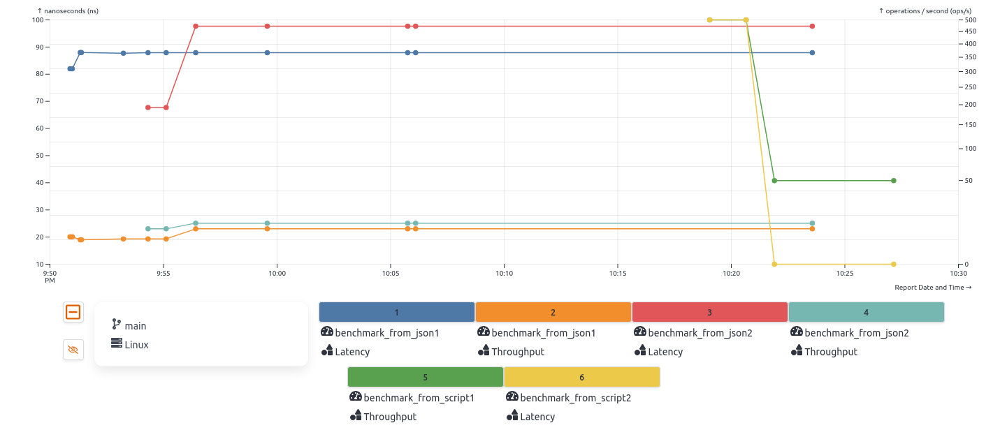

# Bencher

## Ограничения:
1. [Лицензия](https://bencher.dev/legal/license/)
* Весь контент, расположенный в любом каталоге или функции с названием «plus», распространяется по лицензии [Bencher Plus License](https://bencher.dev/legal/plus/).
* Весь остальной контент - Apache License, версия 2.0 или MIT License.
2. Доступные вызовы утилит
* Bencher CLI позволяет запускать любые локальные тесты производительности в формате Bencher Metric Format
* Нет жёстких ограничений на используемые утилиты
3. Требуемая память и накладные расходы
* Локальный запуск требует ресурсов для SQLite и web UI
* CLI не требует каких-то особых ресурсов
4. Место установки и запуска утилит
* Bencher CLI запускается локально или в CI/CD
* Bencher API Server, UI и базы данных размещаются локально либо в облаке Bencher Cloud

## Хранение данных:  
1. SQLite Database
* [Схема бд](https://bencher.dev/ru/docs/reference/schema/)
2. Litestream для репликации и резервного копирования в Object Storage 

## Как развернуть локально

Установка
```
curl --proto '=https' --tlsv1.2 -sSfL https://bencher.dev/download/install-cli.sh | sh

source $HOME/.cargo/env
```

Запуск
```
bencher up
```

По `http://localhost:3000` необходимо зарегистрироваться. Там же можно будет создавать графики и тд.

## Пробные запуски
1. Тесты, предложенные bencher

```
bencher run --project project_name --token your_token --host http://localhost:61016 bencher mock
```

2. Для данных в json файле 
* JSON должен быть оформлен в соответсвии с [BMF](https://bencher.dev/docs/reference/bencher-metric-format/)

```
bencher run --file results.json --adapter json --project project_name --token your_token
```

3. Можно запускать свои скрипты. Нужно только подобрать адаптер для результата скрипта.

```
./my_script.sh | bencher run --adapter json --project project_name --token your_token
```

## Графики

Параметры графиков:
* measurement - метрики. можно несколько
* benchmark - набор тестов. можно несколько
* branch - ветка github. можно несколько
* testbeds - стенд/среда запуска. можно несколько
* диапазон дат отображаемых данных

Пример построенного графика с загруженными псевдоданными:




