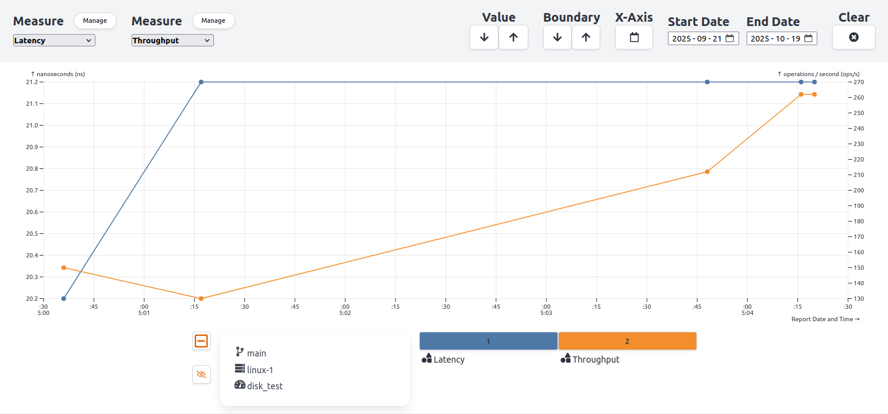
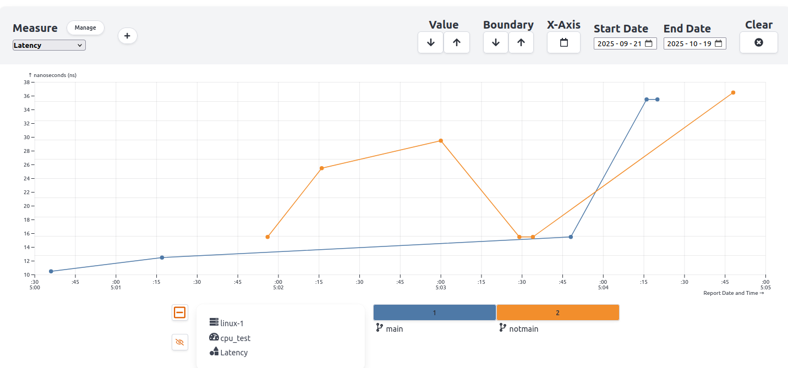
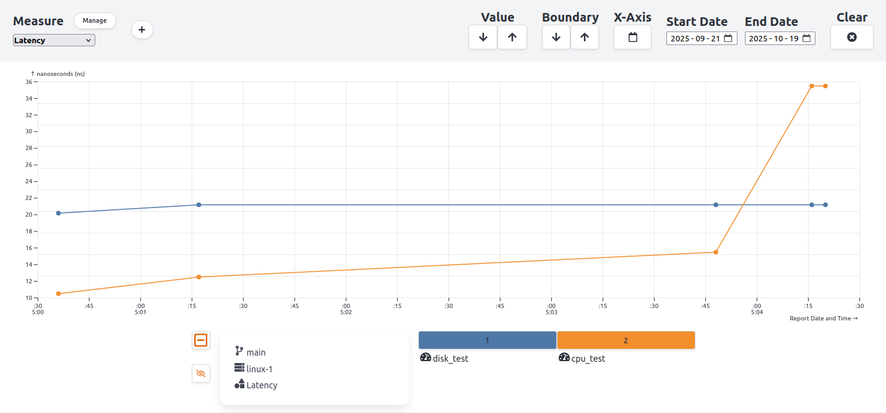

# Bencher

## Ограничения:
1. [Лицензия](https://bencher.dev/legal/license/)
* Весь контент, расположенный в любом каталоге или функции с названием «plus», распространяется по лицензии [Bencher Plus License](https://bencher.dev/legal/plus/).
* Весь остальной контент - Apache License, версия 2.0 или MIT License.
2. Доступные вызовы утилит
* Bencher CLI позволяет запускать любые локальные тесты производительности в формате [Bencher Metric Format](https://bencher.dev/docs/reference/bencher-metric-format/)
* Нет жёстких ограничений на используемые утилиты
3. Требуемая память и накладные расходы
* Локальный запуск требует ресурсов для SQLite и web UI
* CLI не требует каких-то особых ресурсов
4. Место установки и запуска утилит
* Bencher CLI запускается локально или в CI/CD
* Bencher API Server, UI и базы данных размещаются локально либо в облаке Bencher Cloud

## Возможности без подписки

Локальное развертывание:
* Нет ограничений на количество проектов, пользователей, метрик
* Проекты только публичные
* Настройка порогов и аналитика регрессий доступны в базовом режиме
* Можно интегрировать запуск bench-mark’ов в GitHub Actions через API токены, но OAuth через GitHub для входа и автоматизация комментариев в PR — доступны только в облаке или в Plus подписке

Бесплатный тариф Bencher Cloud:
* Только публичные проекты
* До 65535 метрик в день
* Базовые тесты и пороги - расширенная аналитика, например, регрессии с продвинутыми тестами, недоступна
* Базовая GitHub интеграция для запуска тестов и аутентификации

## Хранение данных:
1. SQLite Database
* [схема бд](https://bencher.dev/ru/docs/reference/schema/)
2. Litestream для репликации и резервного копирования в Object Storage

## Как развернуть локально

1. Установка
```
curl --proto '=https' --tlsv1.2 -sSfL https://bencher.dev/download/install-cli.sh | sh

source $HOME/.cargo/env
```

2. Запуск
```
bencher up --api-volume /host/path:/var/lib/bencher/data
```

Опция `--api-volume <HOST_PATH:CONTAINER_PATH>` (аналогично `--console-volume <HOST_PATH:CONTAINER_PATH>`) обеспечивает монтирование. Таким образом можно хранить БД и другие данные.

3. По `http://localhost:3000` необходимо зарегистрироваться. Регистрация локальная. Там же можно будет создавать графики и тд.

## Как развернуть в облаке

1. Установка
```
curl --proto '=https' --tlsv1.2 -sSfL https://bencher.dev/download/install-cli.sh | sh

source $HOME/.cargo/env
```

2. По `https://bencher.dev/` необходимо зарегистрироваться. Там же можно будет отслеживать результаты и тд.

## Пробные запуски

В случае с локальным сервером, необходимо указать `--host <URL>` с адресом локального сервера Bencher (`http://localhost:61016`). По умолчанию это значение `https://api.bencher.dev` или равно значению, прописанному в конфигурации.

1. Генерация синтетических данных bencher

```
bencher run --project project_name --token your_token bencher mock
```

2. Для данных в json файле
* JSON должен быть оформлен в соответсвии с [BMF](https://bencher.dev/docs/reference/bencher-metric-format/)

```
bencher run --file results.json --adapter json --project project_name --token your_token
```

3. Для собственных скриптов. Необходимо подобрать адаптер для результата скрипта.

```
./my_script.sh | bencher run --adapter json --project project_name --token your_token
```

## Графики

Параметры графиков:
* measurement - метрики. Можно выбрать 1-2 метрики для сравнения
* benchmark - набор тестов. Можно выбрать несколько, чтобы видеть результаты разных сценариев. Ограничений по количеству не выявлено.
* branch - ветка репозитория. Можно выбрать несколько для сравнения влияния изменений. Ограничений по количеству не выявлено.
* testbeds - стенд/среда запуска тестов. Можно выбрать несколько для сравнения. Ограничений по количеству не выявлено.
* Диапазон дат отображаемых данных. Можно не указывать, можно указать только одну из дат, можно указать обе.

Все параметры служат для фильтрации и группировки данных. При выборе нескольких значений в одном параметре (напр., несколько метрик, веток или тестов) график содержит объединённые данные для сравнительного анализа. То есть возможно, например, сравнить одну метрику по разным веткам и стендам за последний месяц.

Примеры графиков на псевдоданных:

1. 2 метрики, 1 стенд, 1 ветка, 1 набор тестов


2. 1 метрика, 1 стенд, 2 ветки, 1 набор тестов


3. 1 метрика, 1 стенд, 1 ветка, 2 набора тестов


4. 1 метрика, 2 стенда, 2 ветки, 1 набор тестов

