# Создание дашбордов

Отображение данных в Metabase происходит на **дашбордах** в виде размещенных на них **карточках**.
После поднятия базы данных и контейнеров для metabase для создания дашбордов необходимо:

- Зарегистрироваться или авторизироваться в metabase (локальная учётная запись);
- Создать запросы для карточек к базе данных и настроить их визуализацию;
- Объединить карточки на дашборде и настроить фильтрацию.

## Регистрация/авторизация в metabase

### Создание учетной записи metabase

При первом открытии metabase в браузере (по умолчанию, `localhost:3000`) открывается окно начала работы.
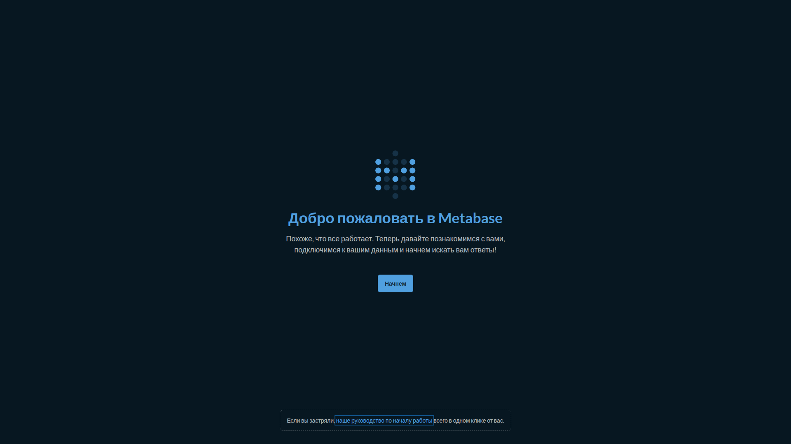

Для продолжения работы требуется нажать кнопку `Начнем`. Дополнительные сведения доступны в [документации Metabase](https://www.metabase.com/docs/v0.59/configuring-metabase/setting-up-metabase.html).

Далее необходимо настроить:
- Данные пользователя metabase. Для примера, создадим пользователя metrics и компанию os-image-testing.
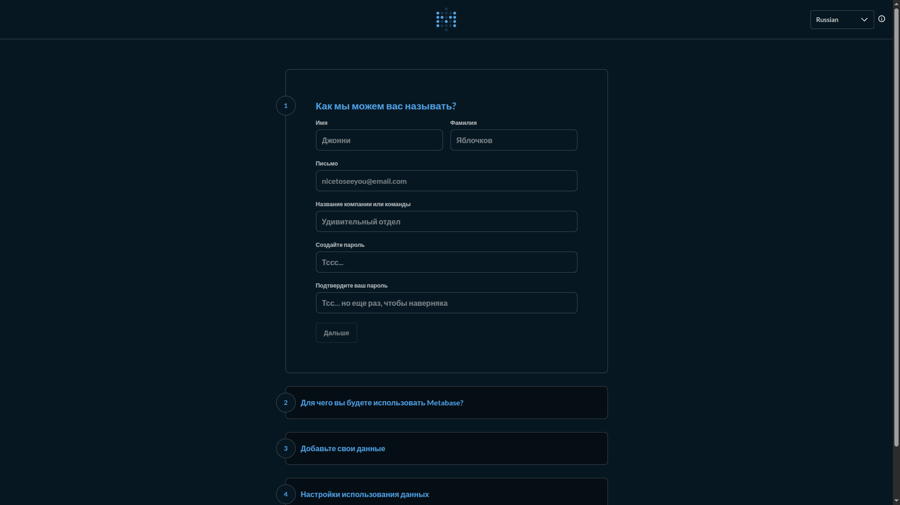
- Цель использования metabase
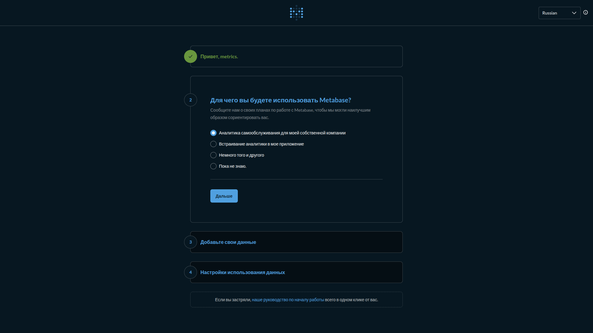
- Подключение к базе данных с основными данными, которые требуется отображать. Для начала необходимо выбрать СУБД,
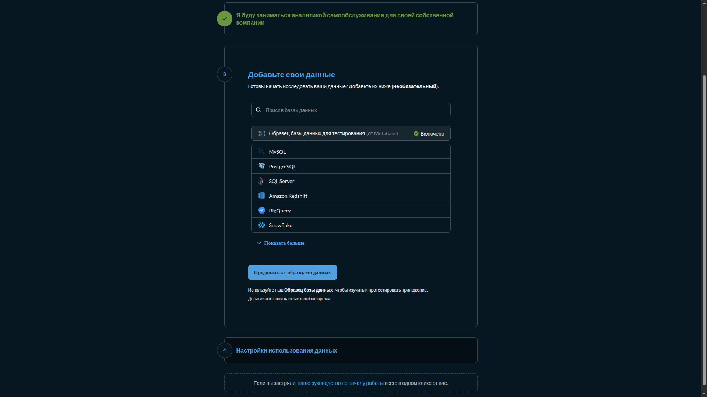
Затем необходимо настроить параметры подключения к базе данных.
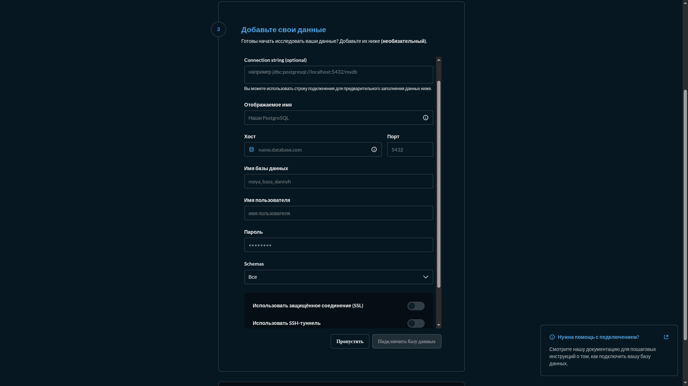
- Разрешение на использование данных
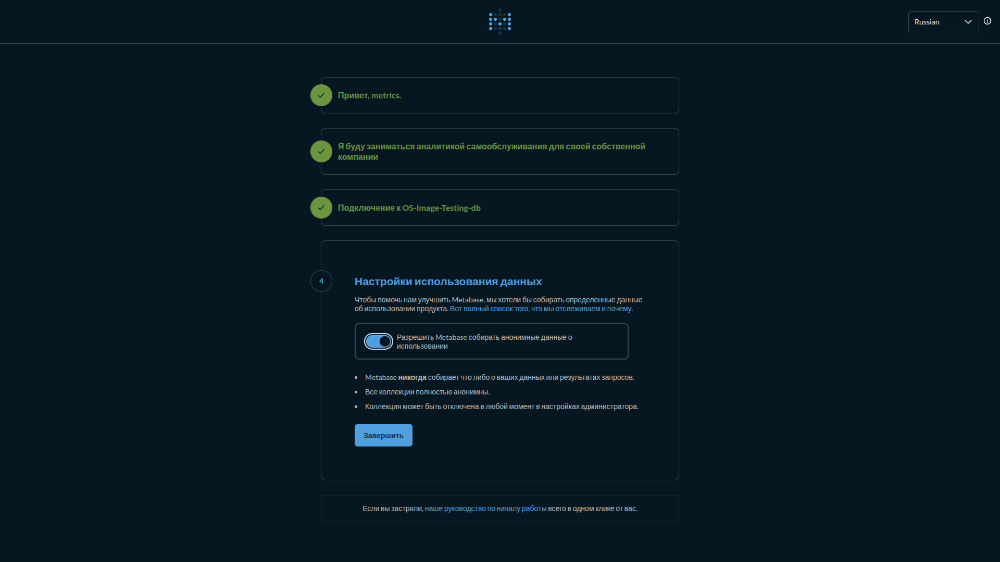

После авторизации появится основное меню metabase.
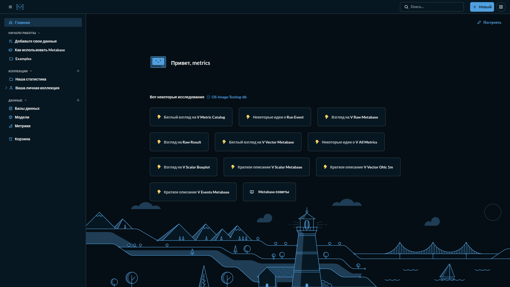

## Создание запросов к базе данных

Перед началом работы рекомендуется настроить коллекцию для сущностей metabase.

### Создание коллекции

Все сущности Metabase (запросы, дашборды) располагаются в определенной **коллекции**.
У пользователя по умолчанию есть собственная коллекция.
Для каждого отдельного проекта рекомендуется создать отдельную коллекцию.

Для этого:
- В меню слева необходимо нажать `Коллекции > + (Создайте новую коллекцию)`
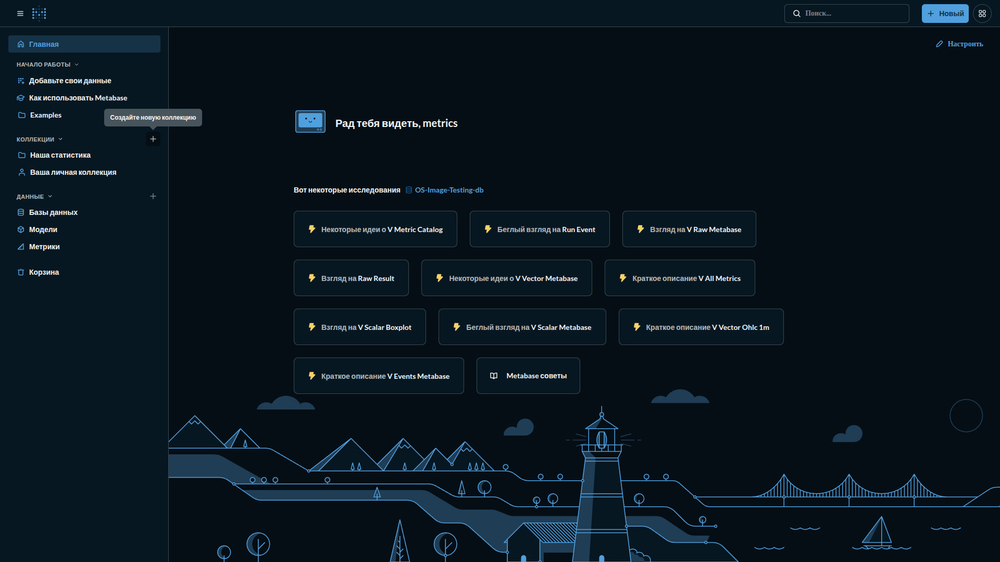
- Настроить Имя коллекции, Описание (опционально) и место (другую коллекцию), где будет сохранена коллекция. Коллекции в metabase - вложенные.
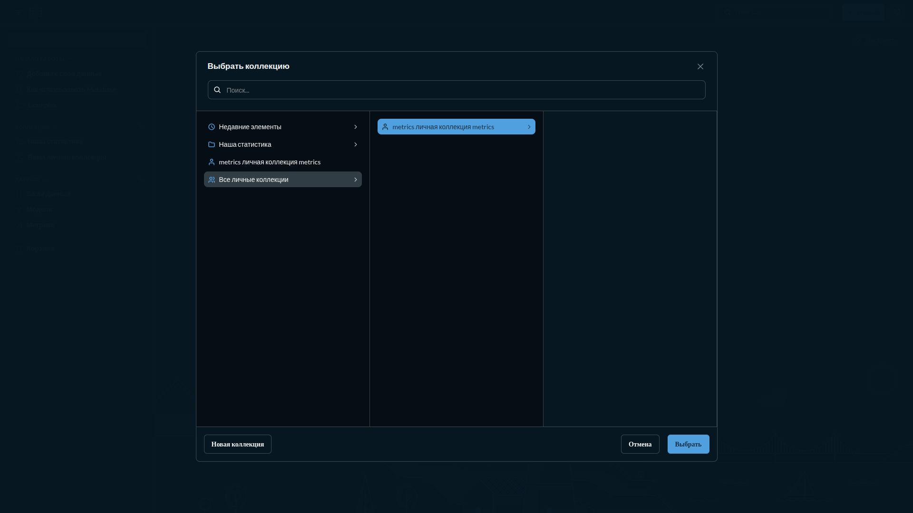

Все сущности, относящиеся к определенному проекту, рекомендуется сохранять в одной выбранной коллекции.

### Создание нового SQL запроса

- Основной механизм получения данных для визуализаци в metabase - SQL-запросы к базе данных.
- Каждый график, диаграмма и таблица требуют указания своего SQL запроса и способа его визуализации.

Для создания нового SQL запроса:
- В меню сверху перейдите `Новый > SQL запрос`
- Откроется меню создания SQL-запроса.
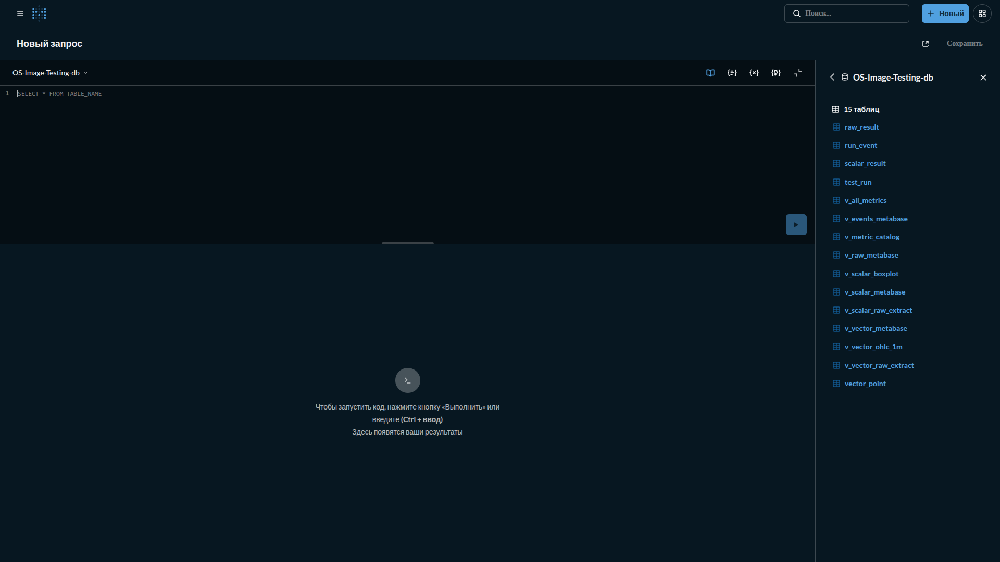
- В поле ввода текста посередине вставьте ваш SQL-запрос.
- Запрос должен обращаться к базе данных, подключение к которой было настроено ранее.

**Настройка переменных в запросе**

- При создании запроса с переменными для фильтрации указывайте переменные как специальный тип переменных metabase - `фильтр поля`. Это позволяет metabase определять значения для фильтрации по уникальным именам в базе.
- Для этого в тексте запроса укажите поле, по которому будет проводиться фильтрация, в двойных фигурных скобках: `{{variable}}`. Используйте фильтр поля везде, кроме отдельных случаев (например, настройки переменной выбора времени).
- Для настройки переменных в меню SQL-запроса откройте справа панель "Переменные и параметры": `{x} (Переменные)`
- Для каждой переменной укажите тип переменной и настройте другие её параметры. Для создания переменной типа "Фильтр поля" укажите:
  - тип переменной - Фильтр поля;
  - таблицу/view в базе, к которой обращается запрос;
  - поле, по которому будет производиться фильтрация.
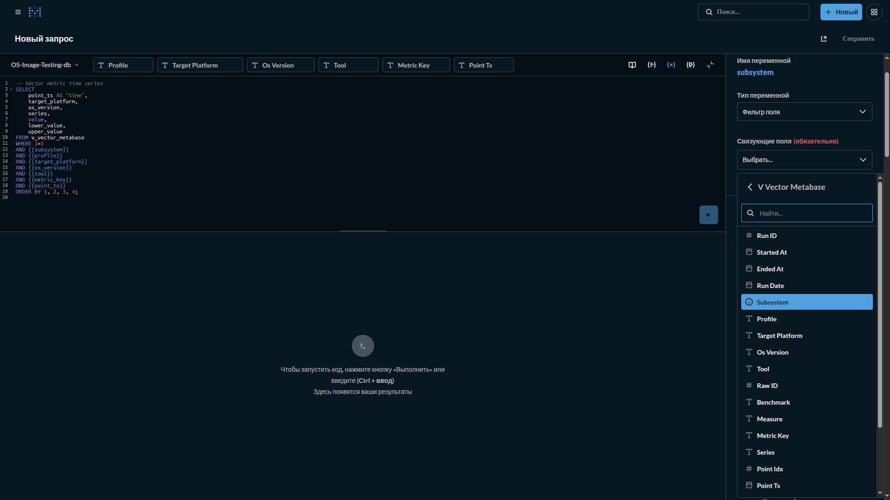

### Визуализация данных

- После настройки текста запроса и всех переменных в запросе нажмине на кнопку `Выполнить запрос`.
- При выполнении запроса отобразится таблица с данными, полученными в результате выполнения запроса
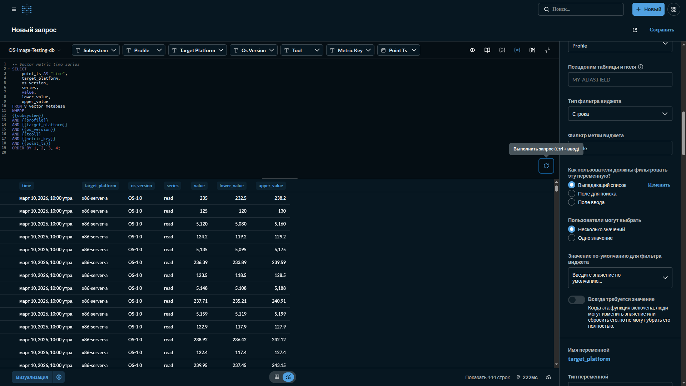
- Для настройки отображения запроса нажмите на кнопку `Визуализация` в левом нижнем углу
- Выберите желаемый тип графика/таблицы/диаграммы
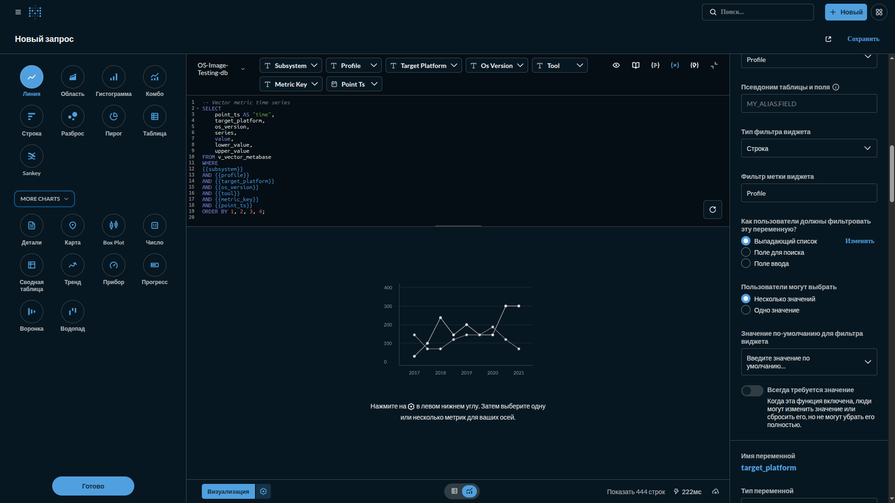
- Нажмите на значок `⛭` рядом с кнопкой `Визуализация` для настройки отображения графика: укажите типы осей, другие параметры.
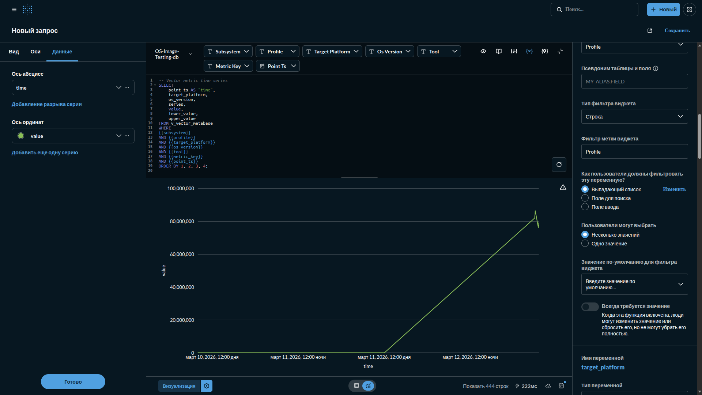
- После настройки отображения нажмите на кнопку `Готово`.

Для сохранения запроса в правом верхнем углу нажмите кнопку `Сохранить`. Укажите:
- Имя запроса,
- Описание (опционально),
- Коллекцию, в которую будет сохранён запрос.

После сохранения запрос появится в выбранной коллекции.

## Создание дашборда

### Размещение карточки на дашборде

Для создания нового дашборда:
- В меню сверху перейдите `Новый > Дашборд`
- Укажите:
  - Имя дашборда,
  - Описание (опционально),
  - Коллекцию, в которую будет сохранён дашборд.
- Откроется меню редактирования дашборда
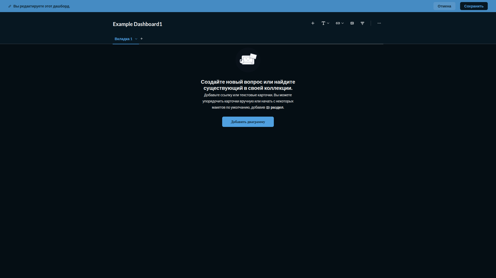
- Нажмите на кнопку `Добавить диаграмму`, в панели справа выберите созданный запрос или создаёте новый.
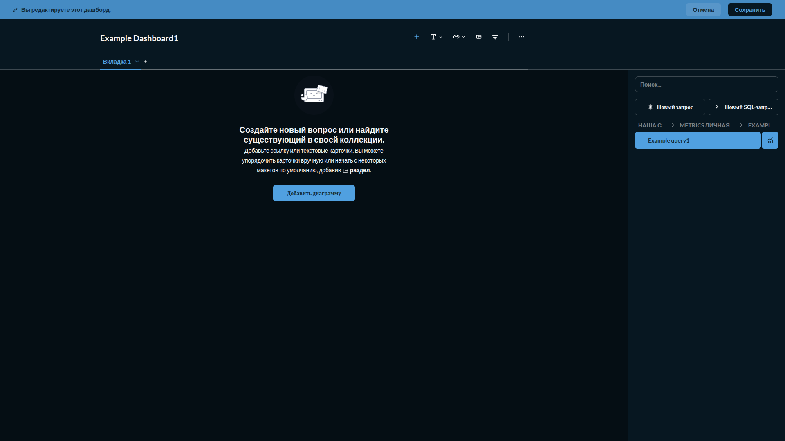
- Расположите карточку запроса на дашборде
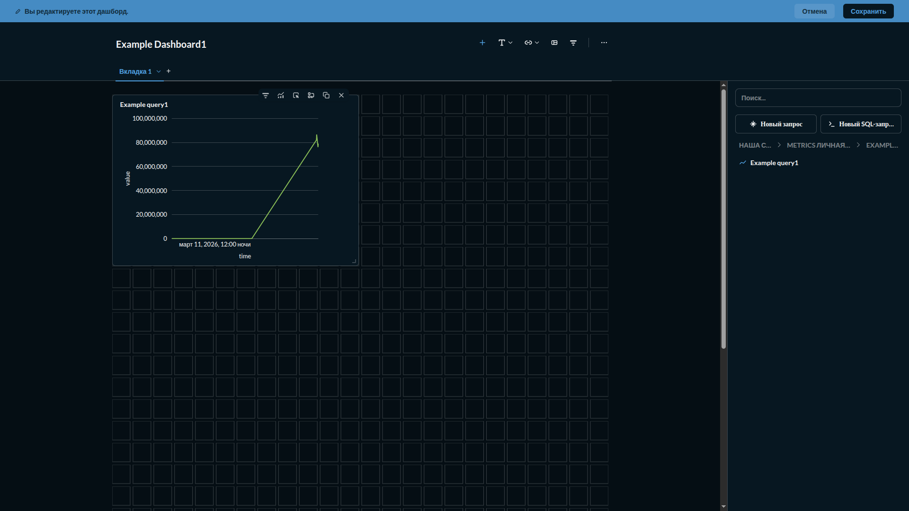

- Размер и расположение карточки на дашборде можно менять, перетягивая и растягивая карточку за её края по сетке.
- Карточки можно располагать на разных вкладках.

### Добавление фильтров

Для фильтрации данных необходимо добавить фильтры по переменным, настроенным при создании запроса.
- В панели сверху нажмите на кнопку с воронкой `(Добавить фильтр или параметр)`
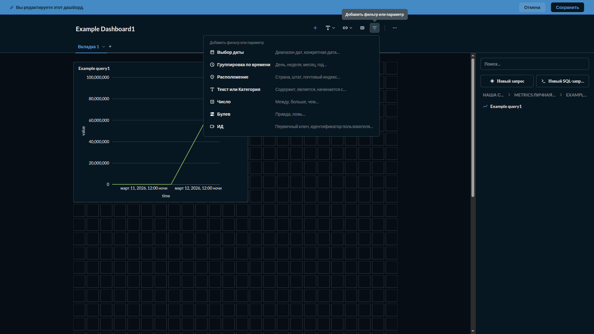
- Выберите подходящий тип фильтра.
- В открывшейся панели справа настройте название фильтра и другие параметры
- На всех нужных карточках на дашборде выберите переменные, по которам будет проводиться фильтрация. Если подходящей переменной не нашлось,исправьте настройки запроса.
- Нажмите на кнопку `Готово` справа снизу.
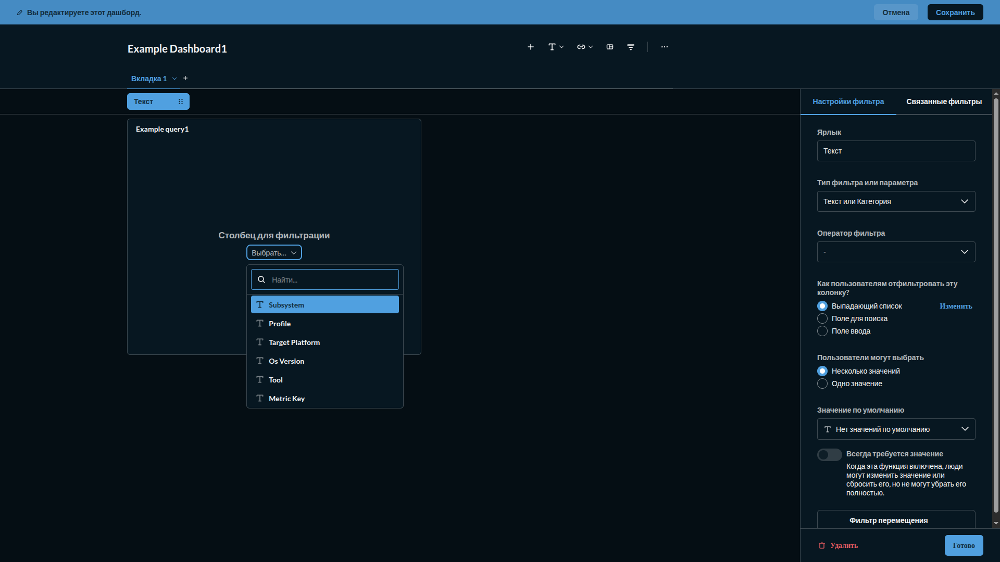

### Сохранение и изменение дашборда

Для сохранения изменений в панели сверху нажмите кнопку `Сохранить`.
- Для изменения дашборда в дальнейшем на окне дашборда в панели сверху нажмите на значок карандаша `Изменить дашборд`.
- Для добавления новых карточек (запросов) в окне редактирования дашборда в панели сверху нажмите `+ (Добавить запросы)`.

## Примечания

- Дополнительные сведения доступны в [документации Metabase](https://www.metabase.com/docs/v0.59/configuring-metabase/setting-up-metabase.html).
