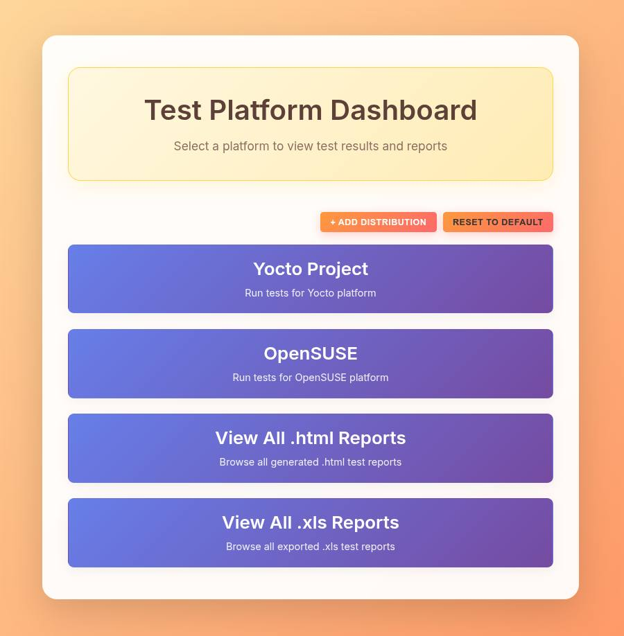
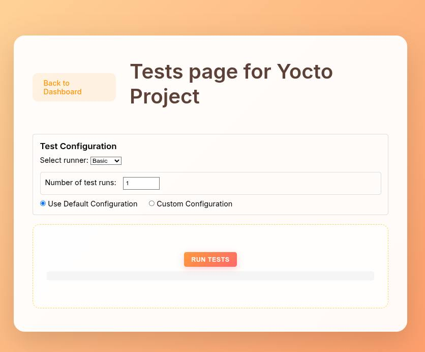
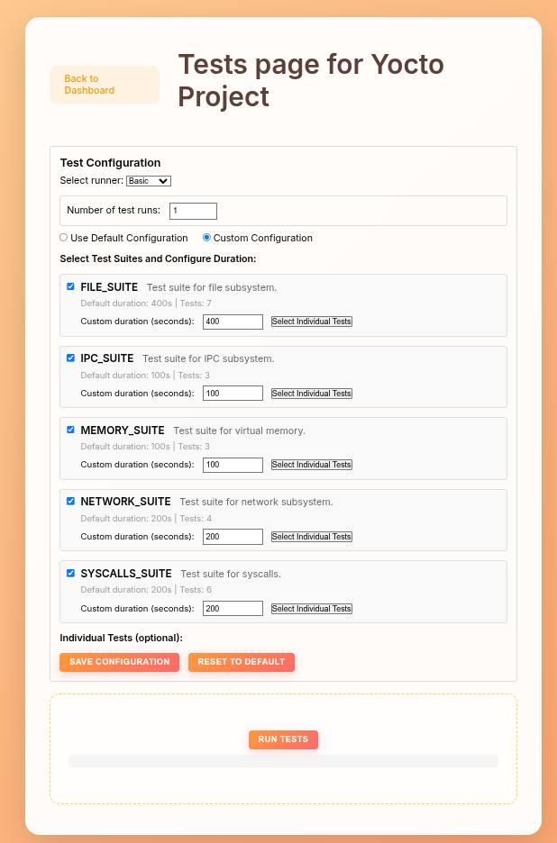
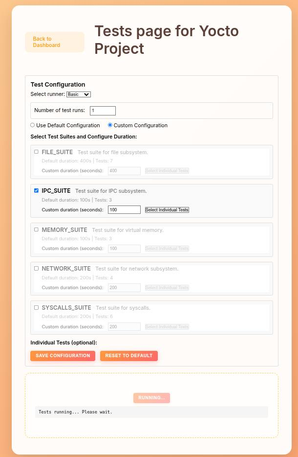
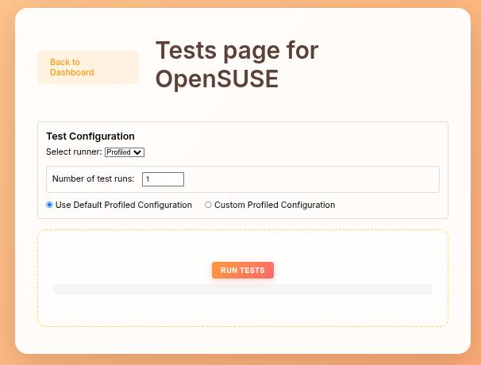
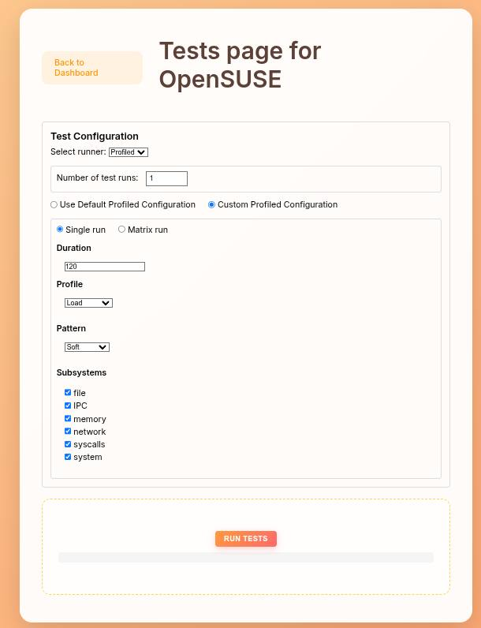
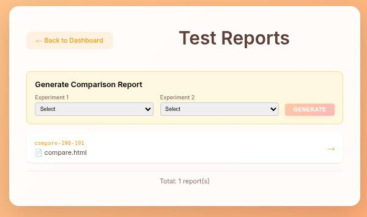
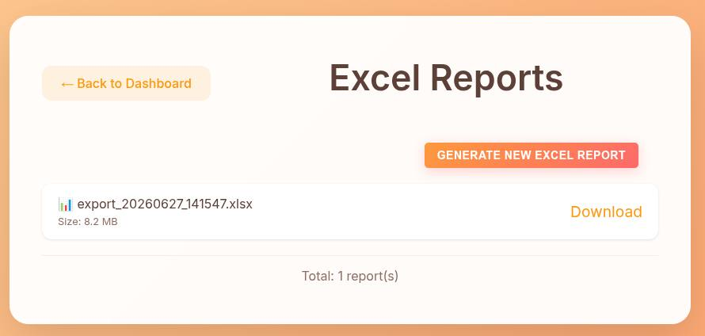

# Сборка образов, запуск тестов и просмотр результатов

## Запуск тестового стенда

В корне репозитория необходимо выполнить:

```bash
make docker-compose-up
```

Команда:

1. Проверяет, что доступен Python 3.11 или новее, и читает список Python-зависимостей из `pyproject.toml`.
2. Инициализирует Git-подмодули командой `git submodule update --init --recursive`.
3. Собирает Docker-образ `imgtests-yocto-builder`.
4. Создаёт отсутствующие Docker volumes для сборки Yocto, загрузок, `sstate-cache`, OpenSUSE, PostgreSQL, Bencher и VictoriaMetrics. Для томов Yocto также настраивается владелец файлов.
5. Выполняет `docker compose up --detach --build`: собирает остальные Docker-образы и запускает сервисы в фоновом режиме.
6. В сервисе `imgtests-yocto` запускается `bitbake`, после чего собранный образ загружается в QEMU. В сервисе `imgtests-suse-156` подготавливается и запускается OpenSUSE в QEMU.
7. В сервисе `imgtests-analyzer` выполняются миграции базы данных, запускаются веб-интерфейс и фоновые обработчики задач.

Для остановки стенда необходимо выполнить:

```bash
make docker-compose-down
```

## Сборка Yocto-образа

### Какой образ собирается

В [docker/image_builder.dockerfile](../../docker/image_builder.dockerfile) клонируется Poky из официального репозитория Yocto Project, ветка `walnascar`. Название собираемого образа задаётся переменной `OS_IMAGE` в [.env.dist](../../.env.dist):

```dotenv
OS_IMAGE=core-image-minimal
```

По умолчанию BitBake собирает `core-image-minimal` для `qemux86-64`. Итоговый QEMU-образ находится в каталоге:

```text
${BUILD_DIR}/tmp/deploy/images/qemux86-64/
```

Ожидаемое имя файла:

```text
${OS_IMAGE}-qemux86-64.rootfs.ext4.qcow2
```

Список созданных файлов можно проверить во время работы контейнера:

```bash
docker compose --file docker/compose.yml --project-directory . \
  exec imgtests-yocto sh -lc 'ls -lh "$BUILD_DIR/tmp/deploy/images/qemux86-64/"'
```

### Как следить за прогрессом сборки

Команда `make docker-compose-up` запускает Compose в режиме `--detach`. Поэтому после сборки Docker-контейнеров процесс BitBake продолжается в фоне. Следить за ходом сборки можно по логам сервиса `imgtests-yocto`:

```bash
docker compose --file docker/compose.yml --project-directory . \
  logs --follow imgtests-yocto
```

В логах BitBake отображаются разбор рецептов, количество запущенных задач и текущие задачи. После успешной сборки запускается `runqemu`, и в логах появляется процесс загрузки Poky.

Состояние всех сервисов можно проверить командой:

```bash
docker compose --file docker/compose.yml --project-directory . ps --all
```

Последние 200 строк логов без режима ожидания:

```bash
docker compose --file docker/compose.yml --project-directory . \
  logs --tail 200 imgtests-yocto
```

### Как понять, что сборка завершилась с ошибкой

Ошибка на этапе сборки Docker-образа отображается непосредственно в выводе `make`: команда завершается с ненулевым кодом, а Docker указывает неуспешный шаг Dockerfile.

Если BitBake завершается с ошибкой, сервис `imgtests-yocto` останавливается. Проверить состояние и код завершения можно так:

```bash
docker compose --file docker/compose.yml --project-directory . ps --all

docker inspect \
  "$(docker compose --file docker/compose.yml --project-directory . ps --all --quiet imgtests-yocto)" \
  --format 'status={{.State.Status}} exit_code={{.State.ExitCode}}'
```

В логах BitBake следует искать сообщения `ERROR:`, `Task (...) failed` и итоговый блок `Summary`. Для завершившейся с ошибкой задачи BitBake также выводит путь к файлу `log.do_<task>` в каталоге `tmp/work/.../temp/`.

После устранения причины сборку можно повторно запустить той же командой:

```bash
make docker-compose-up
```

Тома загрузок и `sstate-cache` сохраняются, поэтому загруженные файлы и результаты успешно выполненных задач могут быть использованы повторно.

### Настройка прокси

Для загрузки системных пакетов, клонирования Poky, получения исходников BitBake и Docker-образов требуется доступ к внешним ресурсам. Если прямой доступ к ним ограничен, необходимо настроить прокси.

Прокси для команд Git, выполняемых на хосте, можно задать через переменные окружения:

```bash
export HTTP_PROXY=http://proxy.example.com:3128
export HTTPS_PROXY=http://proxy.example.com:3128
export NO_PROXY=localhost,127.0.0.1,::1,10.5.0.0/24
```

Для Docker-сборок и создаваемых контейнеров рекомендуется настроить прокси Docker-клиента в `~/.docker/config.json`:

```json
{
  "proxies": {
    "default": {
      "httpProxy": "http://proxy.example.com:3128",
      "httpsProxy": "http://proxy.example.com:3128",
      "noProxy": "localhost,127.0.0.1,::1,10.5.0.0/24,imgtests-postgres"
    }
  }
}
```

После изменения настроек повторить `make docker-compose-up`. 

## Запуск тестов из веб-интерфейса

По умолчанию Django UI доступен по адресу:

```text
http://localhost:8000
```

Порт задаётся переменной `DJANGO_PORT` в `.env.dist`. Перед запуском тестов убедиться, что `imgtests-analyzer`, PostgreSQL и выбранная тестовая система находятся в состоянии `running`.

На главной странице отображаются Yocto Project и OpenSUSE. Кнопка Reset to Default восстанавливает стандартный список платформ — Yocto Project и OpenSUSE, удаляя добавленные пользователем дистрибутивы.

<p align="center">
  
</p>

<p align="center"><em>Рисунок 1 — Стартовая страница веб-интерфейса</em></p>
 Затем:

1. Выбрать тестируемый дистрибутив.
2. Указать число повторов в поле **Number of test runs**.
3. Выберить раннер **Basic** или **Profiled**.
4. Настроить параметры и нажать **Run tests**.
5. Статус фоновой задачи отображается под кнопкой. Дополнительный вывод доступен в логах `imgtests-analyzer`.

### Basic runner

Раннер **Basic** последовательно запускает выбранные наборы готовых тестов и сохраняет результаты каждой утилиты в PostgreSQL.

<p align="center">
  
</p>

<p align="center"><em>Рисунок 2 — Basic runner со значениями по умолчанию</em></p>


Доступны два варианта:

- **Use Default Configuration** — используются стандартные наборы для файловой системы, памяти, системных вызовов, IPC и сети;
- **Custom Configuration** — можно выбрать наборы тестов, изменить их длительность и при необходимости оставить только отдельные тесты внутри набора. Конфигурацию можно сохранить отдельно для каждого дистрибутива.

<p align="center">
  
</p>

<p align="center"><em>Рисунок 3 — Basic runner с выбором наборов и длительности тестов</em></p>

<p align="center">
  
</p>

<p align="center"><em>Рисунок 4 — Basic runner с выбранными тестами после сохранения конфигурации и запуска</em></p>


### Profiled runner

Раннер **Profiled** строит план нагрузки из стадий и запускает задачи для выбранных подсистем. Доступны профили `load`, `stress`, `stability`, `scalability`, `volume`, `isolated`, `spike` и `diagnostic`.

<p align="center">
  
</p>

<p align="center"><em>Рисунок 5 — Profiled runner со значениями по умолчанию</em></p>


- **Use Default Profiled Configuration** — профиль `load`, длительность 120 секунд, все подсистемы и автоматически выбранные шаблоны стадий;
- **Single run** — один выбранный профиль с заданной длительностью, паттерном нагрузки и набором подсистем;
- **Matrix run** — последовательный запуск нескольких профилей, для каждого из которых можно задать отдельную длительность.

Доступные паттерны нагрузки: `soft`, `balanced`, `intense`, `extreme`, `spike`. Доступные подсистемы: `file`, `IPC`, `memory`, `network`, `syscalls`, `system`.

<p align="center">
  
</p>

<p align="center"><em>Рисунок 6 — Profiled runner с настройкой профиля, паттерна и подсистем</em></p>


## Просмотр результатов и отчётов

Все эксперименты и результаты утилит сохраняются в PostgreSQL. На главной странице UI также доступны HTML- и Excel-отчёты.

### HTML-отчёты

На главной странице необходимо выбрать карточку **View All .html Reports**. Далее откроется страница **Test Reports**, также доступная по адресу:

```text
http://localhost:8000/reports/
```

<p align="center">
  
</p>

<p align="center"><em>Рисунок 7 — Страница HTML-отчётов</em></p>


Для запусков с раннером **Profiled** индивидуальный HTML-отчёт создаётся автоматически. В нём доступны:

- сведения об эксперименте и количестве успешных, завершившихся с ошибкой, сломанных и пропущенных задач;
- временная шкала стадий плана, плановая и фактическая длительность;
- агрегированные статистики по числовым метрикам: количество значений, среднее, дисперсия, квартили, 95-й перцентиль, минимум и максимум;
- статистики отдельно по стадиям;
- графики поддерживаемых метрик, включая системную нагрузку, результаты `fio`, `iperf3`, `stress-ng` и других утилит при наличии данных.

На этой странице можно также выбрать два эксперимента и создать сравнительный HTML-отчёт. В нём отображаются общие и уникальные метрики, статистики и визуализации двух запусков.

### Excel-отчёты

На главной странице необходимо выбрать карточку **View All .xls Reports**, откроется страница **Excel Reports**, также доступная по адресу:

```text
http://localhost:8000/excel-reports/
```

<p align="center">
  
</p>

<p align="center"><em>Рисунок 8 — Страница Excel-отчётов</em></p>


Кнопка **Generate New Excel Report** формирует файл `.xlsx` из данных PostgreSQL. В книге находятся:

- конфигурации тестируемых систем;
- список экспериментов, время запуска и итоговые счётчики статусов;
- команды утилит и развёрнутые поля результатов;
- отдельные листы для разных типов тестов и метрик, если они присутствуют в базе.

Готовый файл можно скачать из списка отчётов.

Файлы отчётов создаются внутри контейнера `imgtests-analyzer`:

```text
/home/user/imgtests/results
/home/user/imgtests/excel_reports
```

База PostgreSQL хранится в отдельном Docker volume. Каталоги HTML- и Excel-отчётов в текущем `compose.yml` не подключены к отдельному тому, поэтому перед удалением или пересозданием контейнера важные файлы следует скачать через UI или скопировать на хост.

### Просмотр данных в Metabase

Metabase не входит в текущий `docker/compose.yml` и не запускается командой `make docker-compose-up`. Его можно запустить отдельно:

```bash
docker run --detach \
  --name imgtests-metabase \
  --add-host=host.docker.internal:host-gateway \
  --publish 3001:3000 \
  metabase/metabase
```

После запуска необходимо открыть:

```text
http://localhost:3001
```

При добавлении PostgreSQL надо указать параметры из `.env.dist`:

| Параметр Metabase | Значение по умолчанию |
|-------------------|------------------------|
| Database type     | PostgreSQL             |
| Host              | `host.docker.internal` |
| Port              | `5432`                 |
| Database name     | `os-testing-db`        |
| Username          | `user`                 |
| Password          | `password`             |

Основные таблицы для анализа:

- `configuration` — ОС, ядро, пакеты и сведения об аппаратной конфигурации;
- `experiment` — описание и тип эксперимента, время начала и окончания, количество тестов по статусам;
- `util_run_result` — выполненная команда, тип утилиты, JSON с метриками и время выполнения.
