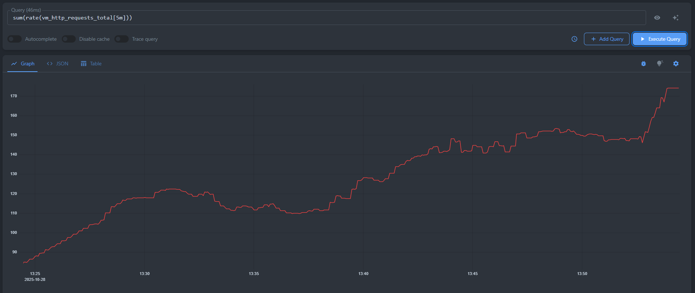

# VictoriaMetrics

[VictoriaMetrics](https://victoriametrics.com/) — это быстрая и масштабируемая система мониторинга и база данных временных рядов. Её используют как хранилище метрик и основу для наблюдений. Её можно применять как долгосрочное хранилище для [Prometheus](https://prometheus.io/docs/) и подключать в [Grafana](https://grafana.com/docs/) для визуализации.

## Какие типы данных можно хранить

### Что именно хранится

Временной ряд — это упорядоченная последовательность точек (value, timestamp), относящихся к одной и той же метрике с фиксированным набором меток. Любое изменение значения любой метки образует другой временной ряд.

### Как хранится временной ряд

- value всегда сохраняется как float64 (даже в случае целых чисел). Строк, булевых значений и JSON в значении метрики не бывает

- timestamp — это UNIX-время с миллисекундной точностью. Если временная метка при записи не указана, берётся текущая

- Метки — строковые пары ключ–значение

### Как выглядит ряд

Идентификация ряда: `имя_метрики{label1="value1", label2="value2", ...}`

Пример:
`requests_total{path="/", code="200"}` и `requests_total{path="/", code="403"}` — это два разных временных ряда, потому что отличается метка `code`

### Типы метрик

VictoriaMetrics принимает те же типы, что и Prometheus

- Counter - это метрика, которая подсчитывает некоторые события.

- Gauge - это текущее значение, например: температура, загрузка CPU в %

- Histogram - это распределение значений

- Summary - публикует готовые ряды с меткой `quantile="0.5|0.9|0.99"`

(В VictoriaMetrics хранится не «тип», а числовые точки (float64) и метки. Типы задаются экспортерами Prometheus)

## Запросы

VictoriaMetrics использует [MetricsQL](https://docs.victoriametrics.com/victoriametrics/metricsql/) — язык запросов, совместимый с [PromQL](https://prometheus.io/docs/prometheus/latest/querying/basics/) (можно брать готовые выражения из Prometheus).

### Где можно выполнять запросы

- [VMUI](https://docs.victoriametrics.com/victoriametrics/quick-start/)

- Grafana

- [HTTP API (Prometheus-совместимый)](https://prometheus.io/docs/prometheus/latest/querying/api/)

  
   
  <em>Рисунок 1 — суммарная скорость HTTP-запросов за последние 5 минут, выполнен в
    <a href="https://play.victoriametrics.com/select/0/vmui/?#/?g0.range_input=30m&g0.end_input=2025-10-28T13%3A59%3A30&g0.relative_time=last_30_minutes&g0.tab=0&g0.tenantID=0">онлайн песочнице VMUI</a>.
  </em>

### Типы запросов

- Instant — значение на один момент времени.

- Range — серия значений за интервал с шагом step (для графиков/скользящих расчётов).

### Какие бывают запросы

- Селекторы

  Например: `<метрика>{<метка>="<значение>", <метка>=~"<регекс>"}` - отбор рядов по меткам

- Агрегации между рядами

  Например: `sum by (<ключи>) (<выражение>)` - сумма по группам рядов
- rollup функции по интервалу

  Например:
  `median_over_time(<метрика>[<окно>])` - расчет медианы

  `quantile_over_time(<доля от 0 до 1>, <метрика>[<окно>])` - расчет квартили/квантили
- Скорости/производные

  Например: `rate(<счётчик>[<окно>])` - средняя скорость роста счётчика

  `irate(<счётчик>[<окно>])` — мгновенная скорость, берёт только две последние точки окна
- Перцентили по множеству источников

  Например: `quantile(<доля 0..1>, <метрика>)` - квантиль по рядам в текущий момент
- Арифметика, сравнения и join по меткам

  Например: `(<метрика>) > <порог>` - сравнение с порогом
- Сортировка/выборка

  Например: `topk(<k>, <выражение>)` - выбрать топ-k рядов
- Управление временем

  Например: `<выражение> offset <интервал>` - сдвиг серии во времени
- Работа с метками

  Например: `label_replace(<метрика>, "<новая>", "<шаблон>", "<старая>", "<регекс>")` - создать/заменить метку

### Ограничения

- `max_rows_per_timeseries` - максимальное количество точек данных, которое может быть выбрано и обработано для одного временного ряда (по умолчанию: 30 000)

- `max_unique_timeseries` - максимальное количество уникальных временных рядов, которые могут быть обработаны в одном запросе (по умолчанию: 300 000)

- `max_query_duration` - максимальное время, отведённое на выполнение одного запроса (по умолчанию: 30 секунд)

- `max_memory_per_query` - максимальный объём оперативной памяти, который может использовать один запрос (по умолчанию: ~1 Гб)

- `max_concurrent_queries` - максимальное количество запросов, которые могут выполняться одновременно (зависит от версии и `search.maxConcurrentRequests`)

- `max_query_len` - максимальная длина URL-адреса запроса (по умолчанию: 16 Кб)

- `max_series_per_user` / `max_series_per_project` - лимит на количество уникальных временных рядов, которые можно записать в базу
### Сравнение данных

Cпециальных «плагинов сравнения» в VictoriaMetrics нет. Сравнение делается на уровне запросов.
