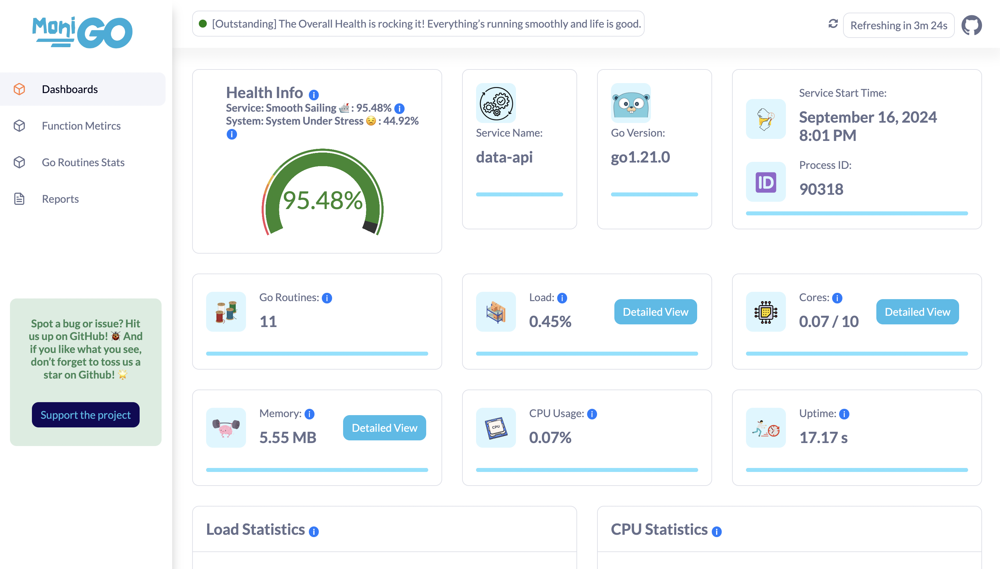

# Monigo
Monigo -- это библиотека для мониторинга производительности приложений на Golang, предоставляющая информацию в режиме реального времени о показателях на уровне сервисов и функций.

Утилита собирает сведения о работе приложений и системы в реальном времени, после чего отображает данные в виде графиков в dashboard-е. Обработанные метрики также можно сохранить в виде JSON или Excel файлов.

Пример dashboard-а:

## Собираемая статистика
Помимо системных метрик, monigo поддерживает трассировку пользовательских Golang функций, их ошибок, параметров и возвращаемых значений наподобие утилиты trace в [BCC](./eBPF-tracing.md#bcc). В рамках тестирования образов данный функционал не представляет интереса, поэтому подробно рассмотрен не будет.

### 1. Статистика нагрузки
Предоставляет статистику общей нагрузки сервиса: нагрузка на CPU, нагрузка на память, нагрузка на систему в целом.

Доступные метрики отображены в виде таблицы:

|Поле                     |Тип данных|Описание                      |
|-------------------------|----------|------------------------------|
|`overall_load_of_service`|`float64` |Общая нагрузка сервиса        |
|`service_cpu_load`       |`float64` |Нагрузка на CPU               |
|`service_memory_load`    |`float64` |Загруженность памяти сервисом |
|`system_cpu_load`        |`float64` |Системная загруженность CPU   |
|`system_memory_load`     |`float64` |Системная загруженность памяти|

### 2. Статистика CPU
Предоставляет статистику об общем количестве ядер, их использования сервисом и системой.

Доступные метрики отображены в виде таблицы:

|Поле                   |Тип данных|Описание                   |
|-----------------------|----------|---------------------------|
|`total_cores`          |`int`     |Общее число ядер           |
|`cores_used_by_service`|`int`     |Ядра, используемые сервисом|
|`cores_used_by_system` |`int`     |Ядра, используемые системой|

### 3. Статистика по памяти
Отображает общий объем системной памяти, память, используемую системой, память, используемую сервисом, доступную память, продолжительность паузы сборки мусора и использование памяти стека.

Доступные метрики отображены в виде таблицы:

|Поле                     |Тип данных|Описание                                 |
|-------------------------|----------|-----------------------------------------|
|`total_system_memory`    |`float64` |Общее число доступной памяти             |
|`memory_used_by_system`  |`float64` |Память, используемая системой            |
|`memory_used_by_service` |`float64` |Память, используемая сервисом            |
|`available_memory`       |`float64` |Доступная память                         |
|`gc_pause_duration`      |`float64` |длительность Garbage collection остановок|
|`stack_memory_usage`     |`float64` |Использование стековой памяти            |

### 4. Статистика профилирования памяти
Предоставляет информацию о выделении памяти в куче службой, выделении памяти в куче системой, общем объеме памяти, выделенной службой, и общем объеме памяти, выделенной операционной системой.

Доступные метрики отображены в виде таблицы:

|Поле                    |Тип данных|Описание                                 |
|------------------------|----------|-----------------------------------------|
|`heap_alloc_by_service` |`float64` |Выделение памяти в куче сервисом         |
|`heap_alloc_by_system`  |`float64` |Выделение памяти в куче системой         |
|`total_alloc_by_service`|`float64` |Общий объем выделенной сервисом памяти   |
|`total_memory_by_os`    |`float64` |Общий объем выделенной системой памяти   |

### 5. Статистика сети
Отображает число полученных и отправленных байтов.

Доступные метрики отображены в виде таблицы:

|Поле            |Тип данных|Описание                                 |
|----------------|----------|-----------------------------------------|
|`bytes_sent`    |`float64` |Количество отправленных байт             |
|`bytes_received`|`float64` |Количество полученных байт               |

### 6. Health метрики
Отображает общий процент значения Health сервиса.

Доступные метрики отображены в виде таблицы:

|Поле                    |Тип данных|Описание                                 |
|------------------------|----------|-----------------------------------------|
|`service_health_percent`|`float64` |Процент *health* сервиса                 |
|`system_health_percent` |`float64` |Процент *health* системы                 |

## Обработка запросов
Обработка запросов осуществляется на стороне веб-сервиса с помощью API endpoint-ов.

Список доступных endpoint-ов представлен в виде таблицы:
|Endpoint                          |Описание                                                            |
|----------------------------------|--------------------------------------------------------------------|
|`/monigo/api/v1/metrics`          |Получить значение всех метрик в текущий момент времени              |
|`/monigo/api/v1/go-routines-stats`|Получить статистику для роутера (не рассматривается в данном обзоре)|
|`/monigo/api/v1/service-info`     |Получить информацию о сервисе                                       |
|`/monigo/api/v1/service-metrics`  |Получить статистику сервиса                                         |
|`/monigo/api/v1/reports`          |Получить историю изменения статистики                               |

Как видно из таблицы, имеется возможность получать статистику в рамках некоторого промежутка времени. Однако никаких методов статистической обработки данных не имеется, все операции придется реализовывать и осуществлять самостоятельно.

## Применение в контексте тестирования образов
Несмотря на наличие общесистемных метрик производительности, monigo специализируется в основном на мониторинге пользовательских приложений на основе Golang. Поэтому в рамках тестирования образов ОС лучше обратить внимание на другие инструменты сбора показателей.
