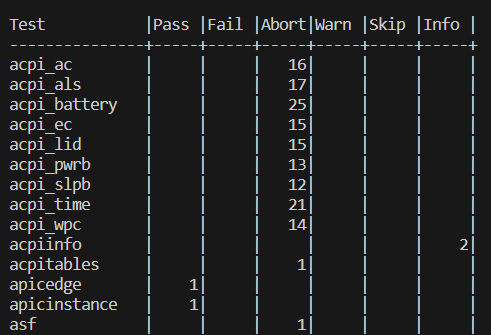

# Тестирование подсистем Linux

## Популярные инструменты тестирования

### fwts

[Firmware Test Suite](https://github.com/fwts/fwts) (FWTS) — набор тестов, который выполняет проверку исправности прошивки.

Он предназначен для выявления ошибок BIOS, UEFI, ACPI и других систем и объяснения причин неисправностей.

fwts нацелен в первую очередь  для диагностики неполадок Linux систем.

#### Интеграция в Yocto

Все необходимые файлы находятся по пути `meta-openembedded/meta-oe/recipes-test/fwts/`.

Тесты можно подключить, добавив в конфигурацию название пакета:

```
IMAGE_INSTALL:append = " fwts"
```

Внутри образа можно прописать команду для запуска тестов:

```bash
fwts
```

В результате будет сформирован файл `results.log` с подробными результатами тестирования.

В файле также содержатся все полученные ошибки, их краткое описание и информация по тестам, записанная в таблицу.



### syzkaller

[syzkaller](https://github.com/google/syzkaller) — автоматизированная система "фаззинга" для ядра Linux.

Непрерывно обрабатывает большое количество случайных программ / входных данных, чтобы вызвать сбои или ошибки (для их выявления).

В процессе работы находит ошибки ядра, утечки памяти, переполнение данных и так далее.

Покрывает следующие подсистемы: `сеть`, `файловые системы`, `память`, а также используется для `драйверов`.

#### Интеграция в Yocto

Находится там же, где fwts, по пути `meta-openembedded/meta-oe/recipes-test/syzkaller`.

Тесты подключаются через конфигурацию:

```
IMAGE_INSTALL:append = " syzkaller"
```

Внутри образа бинарные файлы находятся по пути `/usr/bin/linux_*/`.

Если в образе подключена работа с сетью и есть syz-manager, то можно воспользоваться следующей командой для передачи статистики на localhost:

```bash
./usr/bin/linux_amd64/syz-manager -config my.cfg
```

[Пример конфигурации](https://github.com/google/syzkaller/blob/master/pkg/mgrconfig/testdata/qemu-example.cfg)

В конфигурации можно задать нагрузку: выделить больше ресурсов процессора, памяти или увеличить число процессов.

Для минимального теста без web-интерфейса можно создать подобный файл:

test.txt

```
mmap(&(0x7f0000000000)=nil, 0x1000, 0x3, 0x32, 0xffffffffffffffff, 0x0)
getpid()
openat(0xffffffffffffff9c, &(0x7f0000001000)="./file", 0x42, 0x1ff)
```

И запустить код:

```bash
./usr/bin/linux_amd64/syz-execprog -executor ./usr/bin/linux_amd64/syz-executor test.txt
```

### LTP

[LTP](https://github.com/linux-test-project/ltp) (Linux test project) - обширный набор тестов для тестирования ядра Linux и связанных с ним функций для проверки стабильности и надёжности.

Установка:

```bash
git clone --recurse-submodules https://github.com/linux-test-project/ltp.git
cd ltp
make autotools
./configure
```

Тесты находятся в папке **testcases/**

Их можно использовать для проверки работоспособности практически любых компонентов системы.

Подробное описание тестов в [документации](https://linux-test-project.readthedocs.io/en/latest/users/test_catalog.html).

#### Интеграция в Yocto

LTP нет в стандартных слоях, но его можно добавить, написав собственный рецепт.

## Системные вызовы

### Метрики

- Количество вызовов

- Процент ошибок

### Создание нагрузки

Для создания нагрузки и проверки работоспособности можно использовать утилиту [stress-ng](https://github.com/ColinIanKing/stress-ng).

Пример работы:

```bash
stress-ng --sysinfo 10 --sysinfo-ops 10000
```

### Отслеживание ошибок

**strace** - утилита для отслеживания системных вызовов и сигналов.

Она помогает находить ошибки в работе программ, показывая статистику по тому, какие системные вызовы выполняются и какие ошибки возвращаются.

Пример работы:

```bash
strace -c -f -o trace.log ./test
```

## IPC

К механизмам IPC относят:

- Сигналы
- Каналы
- Сокеты
- Семафоры
- Разделённую память
- Очередь сообщений

### Метрики

- Пропускная способность (количество сообщений, которое ядро или процесс способно обработать)

- Задержки (время между отправкой сообщения одним потоком и его получения другим)

- Процент ошибок (потерянные, повторные сообщения)

### LTP тесты

Тесты лежат в testcases/kernel/syscalls/

- kill, sigaction

- socket, bind, sendmsg

- semget, semop в syscalls/ipc/

- shmget, shmat в syscalls/ipc/

- msgget, msgsnd в syscalls/ipc/

### Мониторинг стабильности

Для мониторинга работоспособности и стабильности IPC можно воспользоваться упомянутой выше **strace** или следующими утилитами:

- **ipcs** для семафоров, разделённой памяти и очередей сообщений

- **ss** для сокетов

- ```lsof | grep FIFO``` для списка открытых каналов

## Виртуальная память

### Метрики

- Используемая оперативная память

- Процент ошибок, неправильных аллокаций

### Создание нагрузки

Для создания нагрузки и проверки работоспособности можно использовать утилиту **stress-ng**.

Пример работы:

```bash
stress-ng --vm 2 --vm-bytes 1G --timeout 1m
```

### Мониторинг стабильности

**vmstat** - virtual memory statistics - утилита для мониторинга стабильности виртуальной памяти, I/O, CPU.

По ней можно понять динамику изменений в функционировании виртуальной памяти.

Пример работы:

```bash
vmstat 1
```

## Сеть

### Метрики

- Пропускная способность

- Задержка

- Процент потерянных пакетов, ошибок

### LTP тесты

К тестам файловой системы можно отнести:

- Всё содержимое testcases/network/

- listen, connect, accept из testcases/kernel/syscalls/

### Тестирование сети

[iperf3](https://github.com/esnet/iperf) - утилита для тестирования сети и её пропускной способности.

Пример работы:

На первом устройстве-сервере

```bash
iperf3 -s -p 8080
```

На втором устройстве-клиенте

```bash
iperf3 -c 127.0.0.1 -p 8080 -t 30 -i 5
```

## Файловые системы

### Метрики

- Пропускная способность

- Скорость чтения и записи

- Процент ошибок

### LTP тесты

К тестам файловой системы можно отнести:

- Всё содержимое testcases/kernel/fs/

- open, close, read, write

- mkdir, chmod, chown

- mount, umount

И другие из testcases/kernel/syscalls/

### Создание нагрузки на файловые системы и диски

[fio](https://github.com/axboe/fio) - flexible I/O tester - утилита для тестирования производительности файловых систем и дисков. Де-факто стандарт для тестирования блочного доступа.

Она позволяет создавать различную нагрузку и измерять основные метрики.

Пример работы:

```bash
fio --name=seq_write --size=2G --rw=write --bs=1M --numjobs=1 --direct=1 --ioengine=libaio --runtime=10s --time_based
```

### Визуализация результатов (fio-plot)

[fio-plot](https://github.com/louwrentius/fio-plot) - утилита, генерирующая графики и диаграммы на основе данных и статистики fio.

Пример работы:

```bash
fio-plot -i . -T "Histogram" -H -r randread
```


### pgbench

[pgbench](https://www.postgresql.org/docs/current/pgbench.html) — утилита тестирования производительности PostgreSQL путём многократного выполнения заданной последовательности команд.

Пример работы:

```bash
pgbench -f test.sql -c 20 -T 30 -r car_station

transaction type: test.sql
number of clients: 20
duration: 30 s
number of transactions actually processed: 645415
latency average = 0.854 ms
latency stddev = 0.228 ms
tps = 21513.140976 (including connections establishing)
statement latencies in milliseconds:
         0.001  \set car_id random(1, 100)
         0.423  SELECT * FROM car WHERE car_id = :car_id;
         0.430  SELECT * FROM car WHERE brand = 'BMW' AND color = 'Синий';
```

### SQLIOSim

SQLIOSim - приложение для имитации действий SQL Server на уровне дисковых операций. Его можно использовать для тестирования надежности и целостности дисковых подсистем.

Пример работы:

```
SQLIOSIM.COM -cfg C:\temp\sqliosim.cfg.ini -log C:\temp\sqliosim.log.xml
```

```
<ENTRY TYPE='INFO' TIME='02:57:30' DATE='11/08/25' TID='9080' User='Монитор' File='FileIO.cpp' Func='CLogicalFile::OutputSummary' HRESULT='' SYSTEXT=''>
<EXTENDED_DESCRIPTION>DRIVE LEVEL: Read count = 145369, Read time = 112396, Write count = 2698947, Write time = 1797779, Idle time = 2047373, Bytes read = 36437557760, Bytes written = 152289914880, Split IO Count = 857, Storage number = 3, Storage manager name = VOLMGR  </EXTENDED_DESCRIPTION>
</ENTRY>
```

### vdbench

[vdbench](https://www.opensourceforu.com/2016/07/vdbench-storage-benchmarking-tool) - утилита для тестирования I/O дисковых подсистем и создания html отчётов. Работает на различных ОС - Linux, Windows, OS/X.

Пример содержимого одного из результирующих файлов:

```
15:41:37.002 Starting RD=SD_format; I/O rate: Uncontrolled MAX; elapsed=(none); For loops: threads=2 iorate=max

Nov 08, 2025    interval        i/o   MB/sec   bytes   read     resp     read    write     read    write     resp  queue  cpu%  cpu%
                               rate  1024**2     i/o    pct     time     resp     resp      max      max   stddev  depth sys+u   sys
15:41:38.042     avg_2-1        0.0     0.00       0   0.00    0.000    0.000    0.000     0.00     0.00    0.000    0.0   NaN   NaN

15:41:39.002 Starting RD=rd1; I/O rate: 100; elapsed=5; For loops: None

15:41:44.013     avg_2-5      102.8     0.10    1024  52.31    0.018    0.013    0.024     0.10     0.14    0.017    0.0   0.7   0.1
```

## Мониторинг утечек

### Метрики

- Потребление памяти

- Соотношение выделенной и освобождённой памяти

### Утилиты для поиска утечек

[valgrind](https://valgrind.org) - популярная утилита для обнаружения утечек и ошибок на уровне пользовательского пространства.

Пример работы:

```bash
valgrind --leak-check=full --show-leak-kinds=all ./test
```

[heaptrack](https://github.com/KDE/heaptrack) - утилита для нахождения утечек в коде.

Предоставляет крайне подробный отчёт об утечках с указанием проблемных мест (есть GUI).

Пример работы:

```bash
heaptrack ./test
heaptrack --analyze "/home/user/heaptrack.test.6202.gz"
```

**kmemleak** - утилита для обнаружения утечек на уровне пространства ядра.

```bash
echo scan > /sys/kernel/debug/kmemleak
cat /sys/kernel/debug/kmemleak
```
