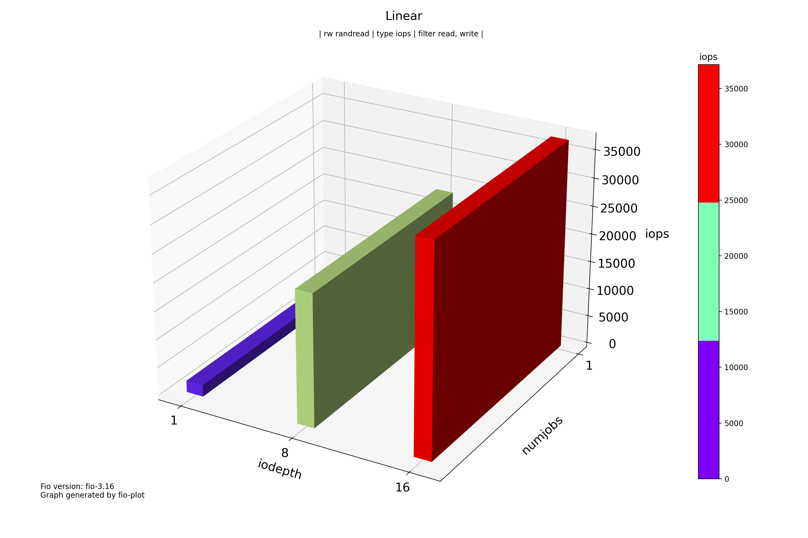
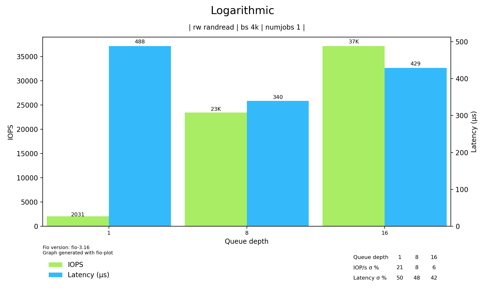
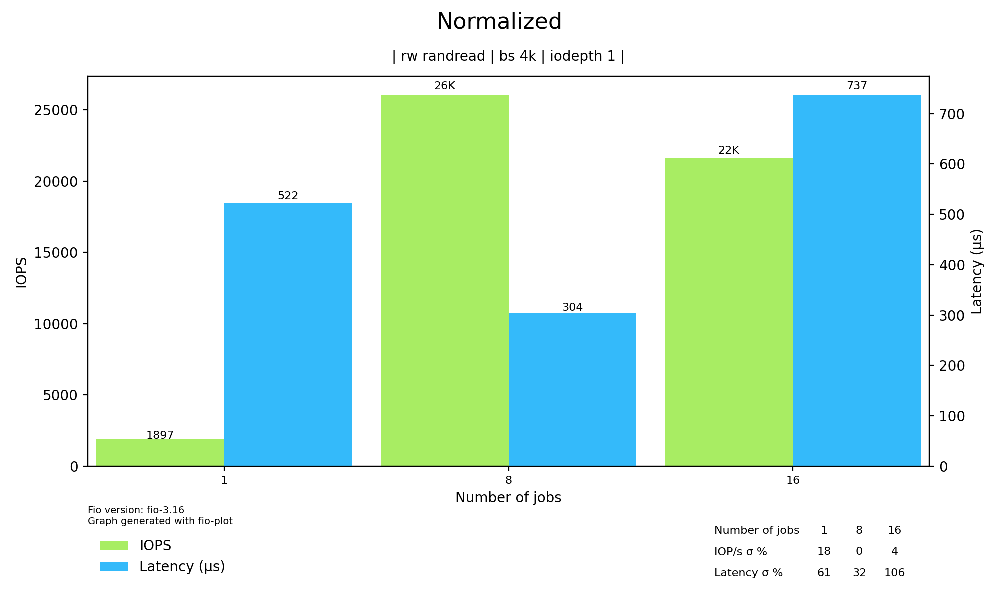
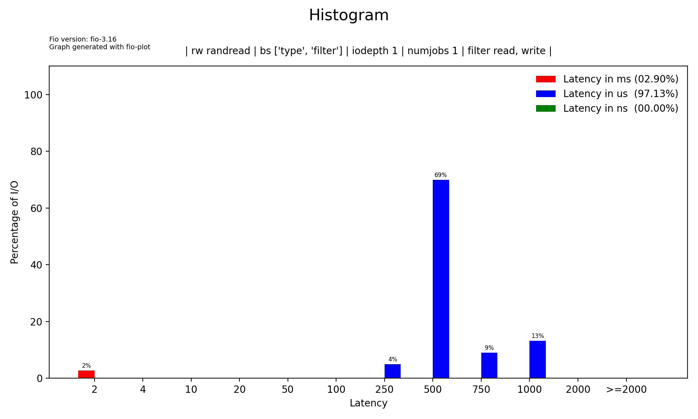

# fio-plot

[fio-plot](https://github.com/louwrentius/fio-plot) - утилита, генерирующая графики и диаграммы на основе данных и статистики fio. Работает с форматами json и csv, поддерживается всеми основными ОС.

Информация по установке есть в репозитории по ссылке выше.

#### Пример работы

Сначала сгенерируем 3 json файла:

```bash
fio --name=test1 --ioengine=libaio --direct=1 --size=1G --runtime=30 --filename=/tmp/testfile --rw=randread --bs=4k --iodepth=1 --numjobs=1 --output=results1.json --output-format=json

fio --name=test2 --ioengine=libaio --direct=1 --size=1G --runtime=30 --filename=/tmp/testfile --rw=randread --bs=4k --iodepth=8 --numjobs=1 --output=results2.json --output-format=json

fio --name=test3 --ioengine=libaio --direct=1 --size=1G --runtime=30 --filename=/tmp/testfile --rw=randread --bs=4k --iodepth=16 --numjobs=1 --output=results3.json --output-format=json
```

Для минимального варианта запуска fio-plot необходимо указать следующие аргументы:
* -i - директория с файлами
* -T - заголовок графика
* (-L | -l | -N | -H | -g | -C) - вид графика (линейный, логарифмический, нормализованный, гистограмма, сгруппированный, временной)
* -r - вид операции

Важно отметить, что fio-plot группирует файлы сначала по --iodepth, затем по --numjobs, поэтому эти параметры должны быть указаны и различны у запусков fio, чтобы не было ошибки.

IOPS (Input/Output Operations Per Second) - количество операций в секунду.

Latency - время выполнения одной операции.

**Линейный график**



```bash
fio-plot -i . -T "Linear" -L -t iops -r randread
```

**Логарифмический график**



```bash
fio-plot -i . -T "Logarithmic" -l -r randread
```

**Нормализованный график**



Для запуска нормализованного графика iodepth будет совпадать, но numjobs должен отличаться.

```bash
fio-plot -i . -T "Normalized" -N -r randread
```

**Гистограмма**



```bash
fio-plot -i . -T "Histogram" -H -r randread
```
